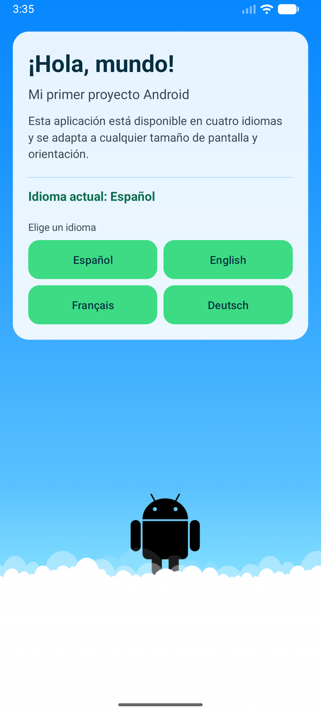
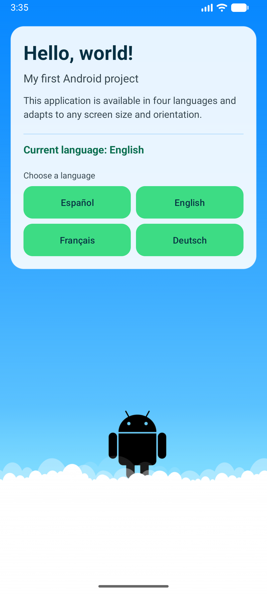
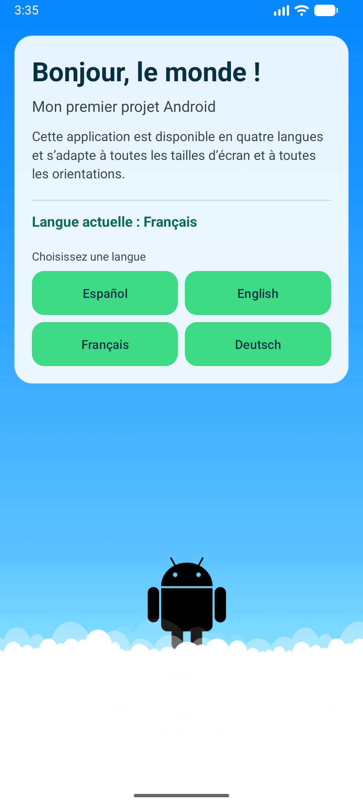
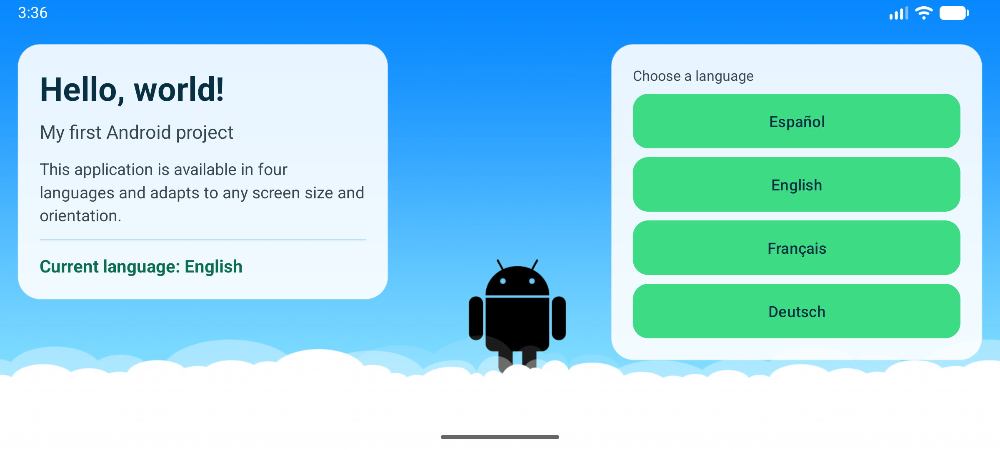
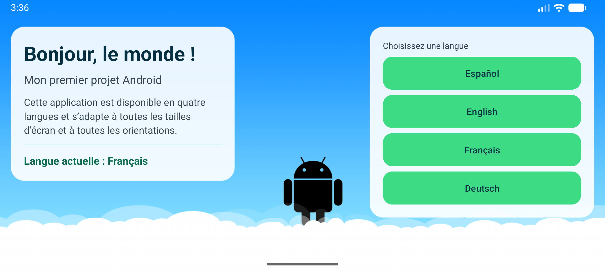
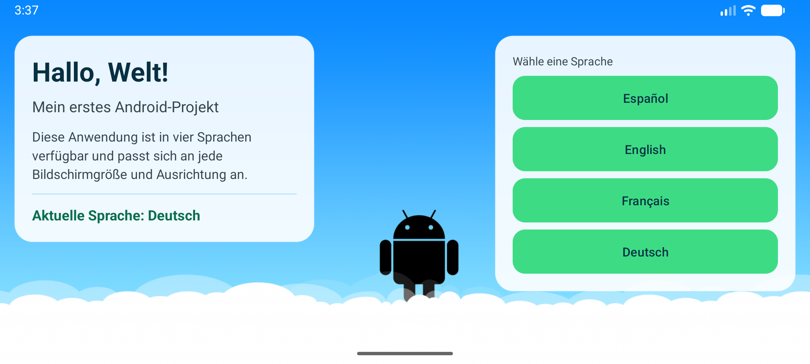

# Mi Primer Proyecto

Aplicación Android nativa hecha con **Java** y **vistas XML** (sin Jetpack Compose).

Es una sola pantalla que muestra un saludo sobre una ilustración del robot de
Android. Desde la misma pantalla puedes cambiar el idioma de la aplicación con
cuatro botones, y todo se reacomoda solo cuando giras el teléfono o cuando la
abres en una tableta.

| Dato | Valor |
|---|---|
| Nombre de la app | Mi Primer Proyecto |
| Paquete | `com.richer.primerproyecto` |
| Lenguaje | Java |
| Interfaz | Vistas XML (`AppCompatActivity`) |
| minSdk / targetSdk | 24 / 36 |
| Gradle | 8.14 (wrapper incluido) con Kotlin DSL |
| Plugin de Android | 8.13.1 |

---

## Qué hace la app

1. Saluda con **«¡Hola, mundo!»** y un subtítulo.
2. Explica en una frase que está en cuatro idiomas y que se adapta a cualquier
   pantalla.
3. Muestra una línea **«Idioma actual: …»** que cambia sola con el idioma.
4. Tiene cuatro botones —Español, English, Français, Deutsch— que cambian el
   idioma **sin salir de la app** y sin tocar los ajustes del teléfono.
5. De fondo usa una imagen *nine-patch* que se estira a pantalla completa sin
   deformar al robot.

---

## Los tres criterios de calificación y dónde se cumplen

### Criterio 1 — La app soporta 4 idiomas (español por defecto, inglés, francés y alemán)

| Qué demuestra el criterio | Archivo |
|---|---|
| Español, el idioma por defecto (marcado con `tools:locale="es"`) | [`values/strings.xml`](app/src/main/res/values/strings.xml) |
| Inglés | [`values-en/strings.xml`](app/src/main/res/values-en/strings.xml) |
| Francés | [`values-fr/strings.xml`](app/src/main/res/values-fr/strings.xml) |
| Alemán | [`values-de/strings.xml`](app/src/main/res/values-de/strings.xml) |
| Lista de idiomas que Android muestra en los ajustes del sistema | [`res/xml/locales_config.xml`](app/src/main/res/xml/locales_config.xml) |
| `android:localeConfig` y el servicio `AppLocalesMetadataHolderService` con `autoStoreLocales` | [`AndroidManifest.xml`](app/src/main/AndroidManifest.xml) |
| El cambio de idioma dentro de la app (`AppCompatDelegate.setApplicationLocales`) | [`MainActivity.java`](app/src/main/java/com/richer/primerproyecto/MainActivity.java) |
| Los cuatro botones que lo disparan | [`layout/activity_main.xml`](app/src/main/res/layout/activity_main.xml) · [`layout-land/activity_main.xml`](app/src/main/res/layout-land/activity_main.xml) |

**Puntos clave:**

- No hay **ningún** texto escrito a mano en los layouts ni en el código Java:
  todos salen de `strings.xml`. Los cuatro archivos tienen exactamente las
  mismas ocho claves traducibles.
- Las etiquetas de los botones (`Español`, `English`, `Français`, `Deutsch`)
  están solo en `values/strings.xml` y llevan `translatable="false"`, porque son
  nombres de idioma escritos en su propia lengua y no se traducen.
- La línea «Idioma actual: …» se arma con dos cadenas: `etiqueta_idioma_actual`
  (`Idioma actual: %1$s`) y `nombre_idioma` (`Español`). Como cada carpeta de
  idioma tiene su propia versión de las dos, la línea se traduce sola.
- Gracias al servicio `AppLocalesMetadataHolderService`, el idioma elegido se
  recuerda al cerrar y volver a abrir la app también en Android 12 o anterior
  (en Android 13 o superior lo guarda el propio sistema).

### Criterio 2 — Usa la imagen como fondo nine-patch, redimensionable sin deformar al robot

| Qué demuestra el criterio | Archivo |
|---|---|
| La imagen nine-patch | [`drawable-xhdpi/fondo.9.png`](app/src/main/res/drawable-xhdpi/fondo.9.png) |
| Se usa como `android:background` de la vista raíz, a pantalla completa | [`layout/activity_main.xml`](app/src/main/res/layout/activity_main.xml) · [`layout-land/activity_main.xml`](app/src/main/res/layout-land/activity_main.xml) |
| Tema sin barra de acción y con barras del sistema transparentes, para que el fondo llegue a los bordes | [`values/themes.xml`](app/src/main/res/values/themes.xml) |
| Dibujo de borde a borde y márgenes de seguridad con los insets del sistema | [`MainActivity.java`](app/src/main/java/com/richer/primerproyecto/MainActivity.java) |

### Criterio 3 — Soporta múltiples pantallas

| Qué demuestra el criterio | Archivo |
|---|---|
| Diseño vertical: contenido arriba en una tarjeta, robot libre abajo | [`layout/activity_main.xml`](app/src/main/res/layout/activity_main.xml) |
| Diseño horizontal: dos columnas, centro libre para el robot | [`layout-land/activity_main.xml`](app/src/main/res/layout-land/activity_main.xml) |
| Medidas para teléfonos (solo dp y sp) | [`values/dimens.xml`](app/src/main/res/values/dimens.xml) |
| Medidas más grandes para tabletas | [`values-sw600dp/dimens.xml`](app/src/main/res/values-sw600dp/dimens.xml) |
| `<supports-screens>` con small, normal, large, xlarge y `anyDensity` | [`AndroidManifest.xml`](app/src/main/AndroidManifest.xml) |
| La tarjeta se centra y nunca pasa de un ancho máximo | [`layout/activity_main.xml`](app/src/main/res/layout/activity_main.xml) (`layout_constraintWidth_max`) |

**Puntos clave:**

- No hay **ninguna** medida en píxeles (`px`): solo `dp` para espacios y `sp`
  para textos. Así todo mide lo mismo en pantallas de distinta densidad, y los
  textos respetan el tamaño de letra que el usuario haya configurado.
- Todo el contenido va dentro de un `ScrollView`: si la pantalla es muy baja
  (o el usuario usa letra muy grande), se puede desplazar y nada se corta.
- Android elige solo la carpeta correcta: `layout/` o `layout-land/` según la
  orientación, y `values/dimens.xml` o `values-sw600dp/dimens.xml` según el
  tamaño. No hay una sola línea de código que pregunte por el tamaño de la
  pantalla.

---

## Cómo funciona el nine-patch, explicado fácil

Un **nine-patch** es un PNG normal con un borde extra de 1 píxel alrededor. En
ese borde se pintan unas marcas negras que le dicen a Android **qué partes de la
imagen puede estirar y cuáles no**. Por eso el archivo se llama `fondo.9.png`:
el `.9` le avisa al compilador de que es una imagen de este tipo.

Imagina la imagen partida en nueve trozos, como un tres en raya. Las esquinas
nunca se estiran, los bordes se estiran en una sola dirección y el centro se
estira en las dos. De ahí el nombre: *nine* = nueve, *patch* = parche.

En esta imagen (1026 × 855 píxeles, de los cuales 1024 × 853 son dibujo real)
las marcas están puestas así:

| Borde | Marcas negras | Qué significa |
|---|---|---|
| Arriba | de 1 a 427 y de 630 a 1024 | Se estira a lo ancho por la izquierda y por la derecha |
| Izquierda | de 1 a 486 y de 721 a 853 | Se estira a lo alto por arriba y por abajo |
| Abajo y derecha | toda la línea | El contenido puede ocupar toda la imagen (relleno cero) |

La franja que **no** tiene marca —de 428 a 629 a lo ancho y de 487 a 720 a lo
alto— es justo el rectángulo donde está dibujado el robot. Al no estar marcada,
Android nunca la estira: el robot siempre se dibuja con su forma original, y el
cielo y las nubes de alrededor son los que crecen o se encogen para llenar la
pantalla.

Los bordes de abajo y de la derecha marcan el **padding** (el relleno interno).
Aquí están pintados enteros a propósito, o sea relleno cero: el contenido puede
ocupar toda la pantalla y los márgenes se controlan desde el layout, que es más
flexible.

Dos detalles más:

- El archivo va en **`drawable-xhdpi`**. Eso le dice a Android que la imagen está
  pensada para pantallas de densidad extra alta. En un teléfono de menor
  densidad, Android la reduce sola; así no se gasta memoria de más ni se ve
  borrosa. Si estuviera en `drawable/` a secas, Android la trataría como mdpi y
  la agrandaría hasta cuatro veces.
- El borde de marcas **no se ve nunca** en la app: AAPT2, el compilador de
  recursos de Android, lo lee al compilar, lo recorta y guarda las medidas
  aparte. Si las marcas estuvieran mal, la compilación fallaría con un error.

---

## Capturas

Tomadas en el emulador `Medium_Phone_API_36.1` (Android 16, 1080 × 2400).

### Vertical

| Español | English |
|---|---|
|  |  |

| Français | Deutsch |
|---|---|
|  |  |

### Horizontal

**Español**


**English**



**Français**



**Deutsch**



Fíjate en que el robot se ve **igual de proporcionado** en las ocho capturas,
aunque la pantalla pase de vertical a horizontal: eso es el nine-patch haciendo
su trabajo.

---

## Cómo ejecutarla

### Opción 1: instalar el APK ya compilado

En la pestaña **Releases** de este repositorio, descarga
`MiPrimerProyecto-v1.0.apk` y ábrelo en un teléfono con Android 7.0 o superior.
Puede que el teléfono pida permiso para instalar apps de origen desconocido.

### Opción 2: abrirla en Android Studio

1. Clona el repositorio:
   ```
   git clone <url-del-repositorio>
   ```
2. En Android Studio: **File → Open** y elige la carpeta del proyecto.
3. Espera a que termine la sincronización de Gradle y pulsa **Run**.

### Opción 3: compilarla desde la terminal

No hace falta tener Gradle instalado: el proyecto trae el *wrapper*.

```
./gradlew assembleDebug          # Linux y macOS
gradlew.bat assembleDebug        # Windows
```

El APK queda en `app/build/outputs/apk/debug/app-debug.apk`.

Para instalarlo en un dispositivo o emulador conectado:

```
adb install -r app/build/outputs/apk/debug/app-debug.apk
```

### Cómo probar los cuatro idiomas

Abre la app y pulsa cualquiera de los cuatro botones: la pantalla se recarga al
instante en ese idioma y lo recuerda la próxima vez que la abras. También puedes
cambiarlo desde **Ajustes → Aplicaciones → Mi Primer Proyecto → Idioma**
(Android 13 o superior).

---

## Estructura del proyecto

```
app/src/main/
├── AndroidManifest.xml                  supports-screens, localeConfig, autoStoreLocales
├── java/com/richer/primerproyecto/
│   └── MainActivity.java                insets del sistema y cambio de idioma
└── res/
    ├── drawable-xhdpi/fondo.9.png       la imagen nine-patch
    ├── drawable/fondo_tarjeta.xml       la tarjeta blanca semitransparente
    ├── layout/activity_main.xml         diseño vertical
    ├── layout-land/activity_main.xml    diseño horizontal
    ├── values/                          español, colores, medidas y tema
    ├── values-en/ values-fr/ values-de/ traducciones
    ├── values-sw600dp/dimens.xml        medidas para tabletas
    └── xml/locales_config.xml           los cuatro idiomas soportados
```
